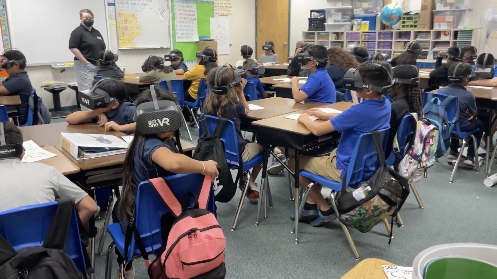

Virtual reality is making its way into industries like training, entertainment, sports, and more; however, there are very few resources available for non-technical people to create and view VR content. That's where BorderlessVR comes in. They provide the hardware if you don't have your own headset, along with a suite of publishing and conversion tools that make it easy to create in VR. Think Squarespace but for virtual experiences.

With a functional prototype of the working system, I led a team of JavaScript, Node, and Unity engineers to create the platform, which allows users to upload flat, panoramic, and stereoscopic images and video and immediately view them in their headsets, all from their browser. We used React to build the frontend, which extended the normal capabilities of a web app by utilizing libraries like WebUSB, WebADB, Service Workers, and a custom implementation of the Cache API.

Check it out here: <a href='https://borderlessvr.com' target='_blank'>BorderlessVR.com</a>.
