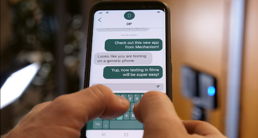

Movies and TV shows often feature actors sending and receiving text messages, and a common visual technique is to display the text bubbles in the foreground similar to closed captions. For Patton Oswalt's latest film I Love My Dad, director James Morosini wanted to focus the camera on the phone and laptop screens instead. This presents a few challenges: 1) the actors had to compose the messages without making any typos, 2) you need someone on the other end to type out and reply to those messages at the right time, and 3) shooting screens in general is difficult. The lighting conditions and refresh rates of the cameras and screens need to be synced up. The last problem was handled by skilled DPs, but for the first two I created a single-page app and database we affectionately called 'Fakebook' internally.

The app has a simple frontend to input conversations. It allows for things like message history, message delays, and typing durations in order to simulate someone responding in real time. It didn't matter where on the keyboard the actor pressed; the correct message would appear every time. This freed the actors up to focus on their performances and meant less work for the post-production team as well.

::video
src: ./media/fakebook.mp4
poster: ./media/fakebook.png
::

The finished product is highly reusable, ready for a role in future TV and film productions.
