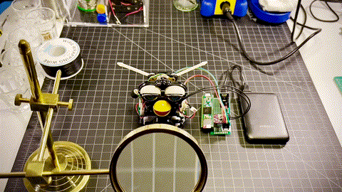

Afterpay reached out to B-Reel to help drive up their winter holiday shoppables. They dug deep into the archives of perfect gifts over the years and came up with a 1998 original Furby™. Our mission: turn the doll into a mystical fortune teller to help shoppers find the perfect holiday gift for the tough ones on their list.

::video
src: ./media/furby.mp4
poster: ./media/furby.png
::

Interestingly, this wasn’t the first, or even the tenth time a Furby had been re-engineered, so I was able to find plenty of circuit diagrams and teardown videos online. I started by dissecting a few of them and measuring voltage in various places. I chose a Teensy 3.6 as the main microcontroller and added things like an audio amplifier, motor driver, IR receiver, and a USB rechargeable battery. All of the doll's "animations" are driven by a single motor, so it was really just a matter of driving it forward and backward while measuring how many revolutions the main cam was making. The original mechanism is quite an interesting piece of technology involving switches and light sensors to measure motor movement. This allowed the original engineers of the doll to run the motor at high speed without losing track of things like how far open the eyes and mouth are. The Teensy comes with an SD card reader, so I used that to store the custom MP3 files. I also swapped out the tiny remote control that comes with the IR receiver for a generic TV remote, which gave us 10 times the range.

The final dolls were “reskinned” with handsome turquoise Afterpay suits and performed beautifully. To see some videos of the campaign, just go on <a href='https://www.tiktok.com/@afterpayusa/video/7038967684603727110?lang=en&is_copy_url=1&is_from_webapp=v1' target='_blank'>Afterpay’s TikTok account</a>.
