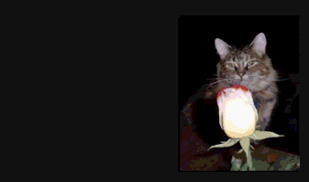

During a late-night insomnia-fueled scrolling session, I discovered https://infinitecat.com, the internet's longest-running website dedicated to cats. The original site started in 1995 and ran until 2020. Its main feature was a gallery of user-uploaded photos of their cat (or cats) looking at the latest cat on the site, creating an 'infinite' sequence of cats looking at cats looking at cats.

Recently I'd been using OpenCV for marker detection and tracking, and decided to try out the tech on cat photos. I wrote a Node.js script to scrape and sort the 15+ years of photos from the original web server and used OpenCV to discover each cat image in the monitor of the image that preceded it. A few times the detector needed some supervision, but for the most part it was able to identify the entire chain of almost 1,900 cats! I then ran another OpenCV script to <a href='https://docs.opencv.org/4.x/d9/dab/tutorial_homography.html' target='_blank'>compute the homography matrices</a> of each image.

At that point, I moved into the browser and used the data to distort each image until it matched its 3D position in the preceding image. Finally, I used CSS Matrix4 transformations to perform a "corner pin" effect and then animated it in JavaScript.

::video
src: ./media/catdive.mp4
poster: ./media/catdive.png
::

The end result was sort of mesmerizing and performed extremely well on desktop and mobile. The original site was eventually purchased by a pet company and used to generate traffic to their site, but my prototype lives on at infinitecat.com. Go <a href='https://daveseidman.github.io/infinite-cat/' target='_blank'>check it out</a> and enjoy an "endless" stroll through an infinite sequence of cats.
