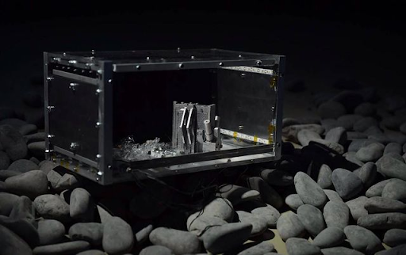

The inspirational <a href='https://www.xxxxxxxxxinliu.com/' target='_blank'>Xin Liu</a> partnered with the <a href='https://newlab.com/' target='_blank'>New Lab</a> to design and build a small robot that was sent into space aboard one of the first Blue Origin rockets. The robot was mounted to the floor of a small locker during liftoff. Once in space, the rocket's main computer sent a signal to the locker, triggering the mounting clips to release. The robot was then free to float around the locker.

Xin's team was looking for a software engineer to design a guidance system to help the bot determine its relative position and orientation. For propulsion, the bot was designed to have several high-speed gyroscopic motors that would turn relatively heavy discs, creating torque in the weightless conditions of space.

::video
src: ./media/living-distance.mp4
poster: ./media/living-distance.png
::

Because the locker was outfitted with bright LEDs, we decided to create a visual system. I started with a virtual camera inside 3D software and placed it inside a cube with the AR tracking images as textures on its inner panels. I used OpenCV's homography library to calculate the position based on ArUco markers attached to the inside of the locker. Read more <a href='https://www.xxxxxxxxxinliu.com/#/living-distance/' target='_blank'>here</a>

