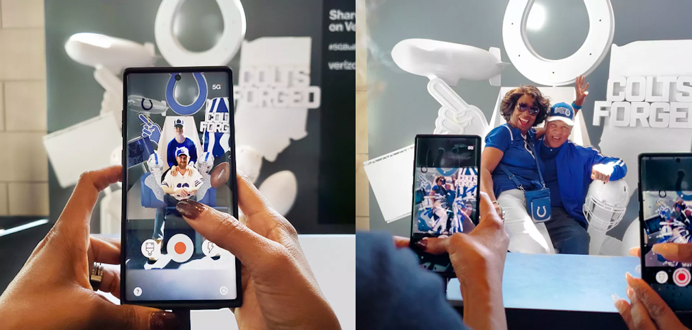

I partnered with <a href='https://buck.co/work/verizon-nfl-ar-experience' target='_blank'>Buck</a> to help Verizon show off the speed of their first generation of 5G phones via an innovative AR experience tied to the NFL's 100th season. Our team set up 10 life-size thrones at football stadiums across the country. The thrones themselves were completely blank, but came to life when viewed through our mixed reality app. Fans were invited to sit down while their friends recorded short videos of them. Our custom app tracked every surface of the thrones and allowed the viewer to add textures, animations, and particle effects in real time.

::video
src: ./media/nfl-thrones.mp4
poster: ./media/nfl-thrones.png
::

Once finished, users could send themselves their video or directly share it on social media. Thousands of people sat down and even more shared their fandom by recording videos of the experience.

Our first technical challenge was tracking a solid white throne in 3D space without relying on tracking markers or QR codes. We used Vuforia's 3D model target system and trained it on 3D models of the thrones. Once that started working, we could render 3D graphics that were perfectly aligned to the throne, but also on top of the people sitting in the throne. We overcame this by adopting body-segmentation AI to differentiate between the throne and the person so that the graphics were no longer rendering on top of them. The end result was an exciting opportunity that attracted thousands of people to sit down and even more to share their fandom online.
