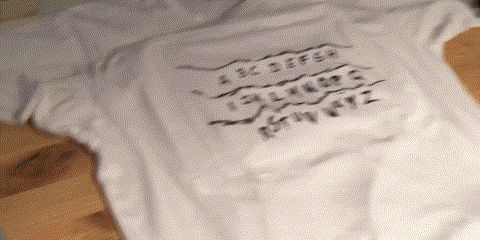
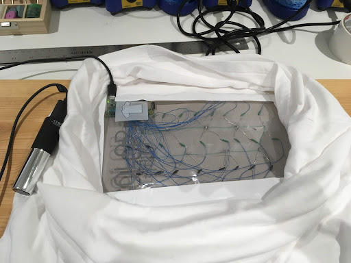

A scene from the cult classic show Stranger Things featured a wall of Christmas lights that lit up in succession to spell out messages from another dimension. With Halloween approaching, I got to work on a quick build-out to replicate the iconic scene as an interactive T-shirt.

The Raspberry Pi Zero has just enough pins that can be set to output for each letter of the alphabet, so instead of charlieplexing or using an LED driver, I connected each LED directly to the board using a thin-gauge wire wrap.

Once the hardware was built and tested, I wrote a small server that listened for messages over Wi-Fi. I finished it off with a frontend that allowed me to either tap directly on the screen to light up the LEDs or type out messages and play the sequence on the shirt. A small backup battery kept the system running long enough to fill a pillowcase full of candy.
