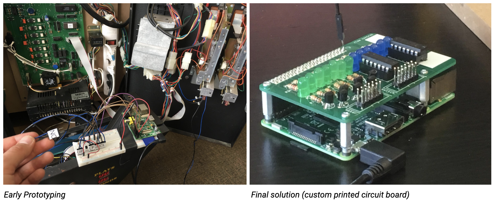
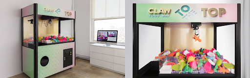

NYC-based creative agency B-Reel likes to take long-standing, tried-and-true business practices and turn them on their head. Case in point: instead of using a placement agency or headhunters to recruit new talent, we took a 6' tall arcade claw machine apart, rewired it, and put it on the internet. The concept was for job seekers to “line up” and play the machine remotely via their desktop or mobile browsers. Every user had a chance to grab one of 200+ homemade prizes, each of which correlated to a different interview type, such as interviews on Segways or tandem bike rides, during massages, or on a dog walk.

::video
src: ./media/the-claw.mp4
poster: ./media/the-claw.png
::

I started by carefully taking the original machine apart and finding circuit diagrams from similar machines online to slowly figure out the machine's inner workings. Fun fact: these games ARE rigged! The claw is programmed to weaken its grip when it's on the way to the prize chute, making the user feel like they were "so close" when in reality the claw intentionally dropped the prize too early. Then we began tying into the machine via jumper wires hooked up to a Raspberry Pi (microcomputer). Once we finalized our logic, we printed custom circuit boards and soldered them into “Pi hats” to make our connections sturdier and modular. When the Pis were able to control the machines, we began forwarding traffic through our router so that we could start activating and listening to the machine's various motors and sensors over the internet.

For the prizes, we used 3D printers to produce unique models for each interview type. Prize detection was eventually handled by RFID scanners and small stickers attached to each prize, but we explored a lot of other options, including AI image classification. Another boon for this method: all the models already existed in 3D, so instead of taking lots of pictures to train our AI model with, we simply rendered thousands of each in parallel.

The final product was a great success, won an FWA, and stayed online for over a month with very little downtime (except for a few times I had to crawl inside the machine to free a stuck motor or prize). More than 5,000 unique visitors played and over 200 won interviews, leading to three new hires that will always have a great story to tell when asked how they started working with the agency.

<a href='https://thefwa.com/cases/claw-your-way-to-the-top' target='_blank'>Read more here</a>
